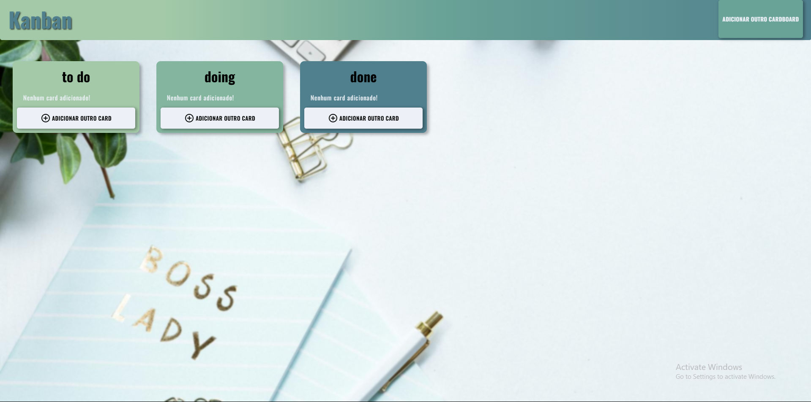

<h1 align="center">
  Kanban App
</h1>

  

## 💻 Projeto

App **Kanban** onde anota tarefas que são separadas em cartões: to do, doing, e done. Dá para criar cartões, remover cartões, criar tarefas , remover tarefas ou mover elas entre os cartões existentes.

## 🚀 Tecnologias

- HTML
- CSS
- JavaScript

## 📚 Conceitos estudados

- [x] Uso semântico do HTML
- [x] Uso do CSS Grid
- [x] Pseudo-elementos
- [x] Positions;
- JavaScript métodos:
- [x] insertAdjacentHTML(); 
- [x] .parentNode; 
- [x] .remove(); 
- [x] map();